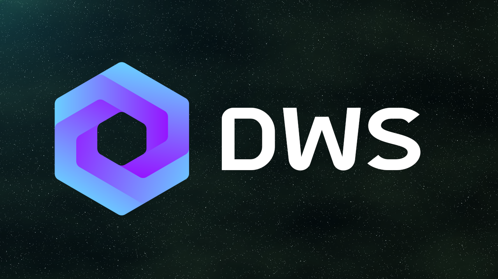

# Decentralized Web Services (DWS) Blockchain



[](https://github.com/deweb-services/deweb/releases)

[](https://discord.gg/dws)
[](https://discord.gg/dws)

## Hardware Requirements

Here are the minimal hardware configs required for running a validator/sentry node

- 8GB RAM
- 4vCPUs
- 300GB Disk space

## Software Requirements

Install deps

```
sudo apt-get install build-essential jq
```

## Compile instructions: install GoLang

Install Go 1.19.x
The official instructions can be found here: https://golang.org/doc/install

First remove any existing old Go installation as root

```
sudo rm -rf /usr/local/go
```

Download the software:

```
curl https://dl.google.com/go/go1.19.linux-amd64.tar.gz | sudo tar -C/usr/local -zxvf -
```

Update environment variables to include go (copy everything and paste)

```
cat <<'EOF' >>$HOME/.profile
export GOROOT=/usr/local/go
export GOPATH=$HOME/go
export GO111MODULE=on
export GOBIN=$HOME/go/bin
export PATH=$PATH:/usr/local/go/bin:$GOBIN
EOF
source $HOME/.profile
```

To verify that Go is installed:

```
go version
```

Should return go version go1.19 linux/amd64

## Compile `dewebd` source code by yourself

### Download source code and compile

```
git clone https://github.com/deweb-services/deweb.git
cd deweb
git checkout v0.3
make build   #it build the binary in build/ folder
```

To know the version:

```
build/dewebd version
```

The output must be `0.3`

Is the version match, now you have two options

- Move the binary to the /usr/local/bin path with: `sudo mv build/dewebd /usr/local/bin/`
- Compile and install the binary in the $GOPATH path: `make install`

## Join our Sirius Testnet

Sirius testnet chainId: `deweb-testnet-2`

- [Instructions](https://docs.deweb.services/guides/validator-setup-guide)
